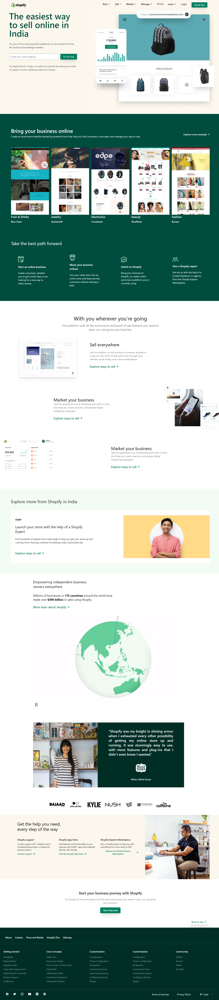

### I made [shopify india/](https://shopify.in/) landing page design using Tailwind css only

### 📌Resources and and its corresponding CDN links
- Fonts
    - Great and Vibes
        ```html
              <link href="https://fonts.googleapis.com/css2?family=Great+Vibes&display=swap" rel="stylesheet">

        ```
 - taiwind custome config
    ```js
        
        tailwind.config = {
            theme: {

                extend: {
                    colors: {
                        'skin': '#fbf7ed',
                        'black': '#212326',
                        'green': '#008060',
                        'darkgreen': '#004C3F',
                    }
                }
            }
        }
    

    ```
- CDN Flowbites(only for navbar) 
    ```html
        <!-- put this in side head -->
        <script src="https://cdnjs.cloudflare.com/ajax/libs/jquery/3.5.1/jquery.min.js"></scrip>
        <!-- put this one befor body end -->
        <script src="https://unpkg.com/flowbite@1.5.2/dist/flowbite.js"></script>

    ```
- ION Icon cdn
    ```html
        <!-- paste before body tag get closed -->
          <script type="module" src="https://unpkg.com/ionicons@5.5.2/dist/ionicons/ionicons.esm.js"></script>
          <script nomodule src="https://unpkg.com/ionicons@5.5.2/dist/ionicons/ionicons.js"></script>

    ```


## What I Learned from this Project?

- I learned more efficient use of Tailwind CSS by getting hands-on experience.
- I also learned how greatly the nuances of a website matter and got proficient in taking care of the them while building it any site.

## Author

- [@Titiksha2012](https://github.com/Titiksha2012)

